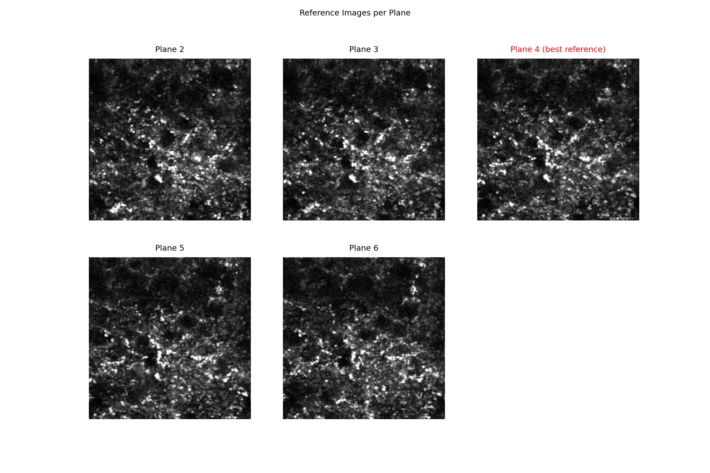
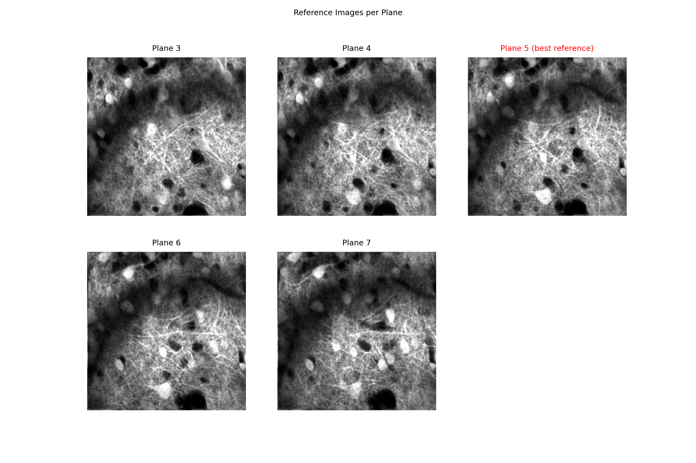
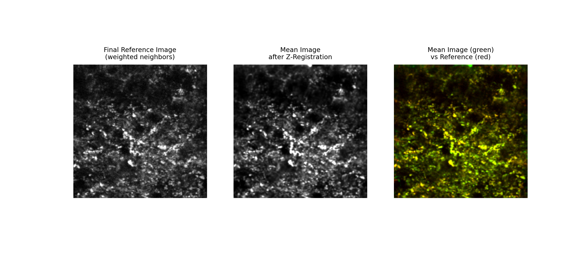
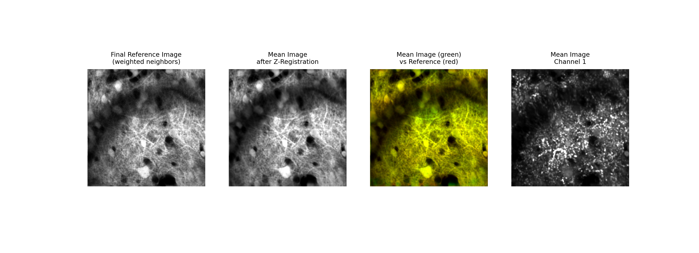
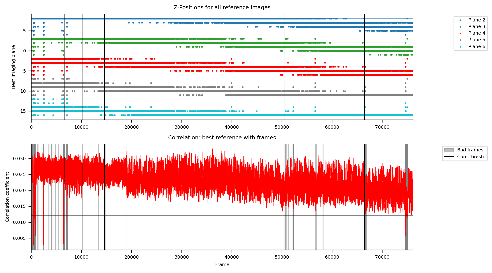
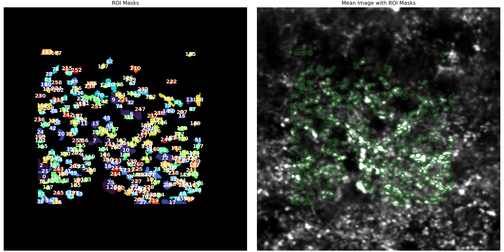
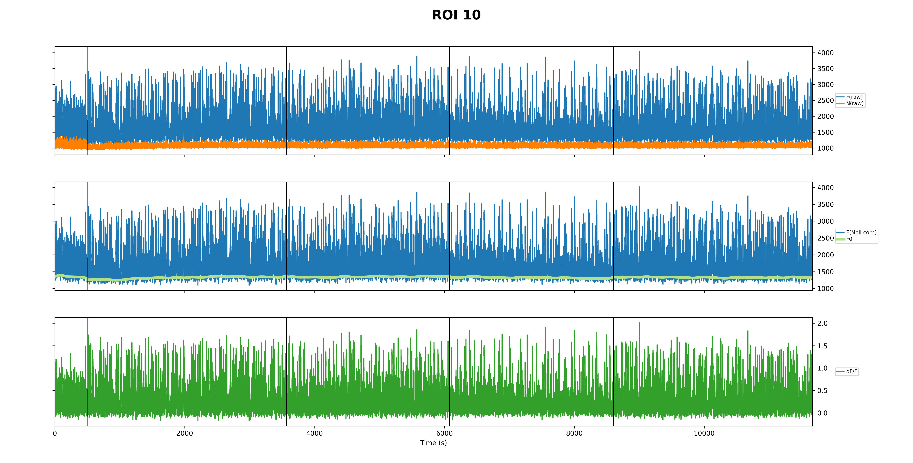
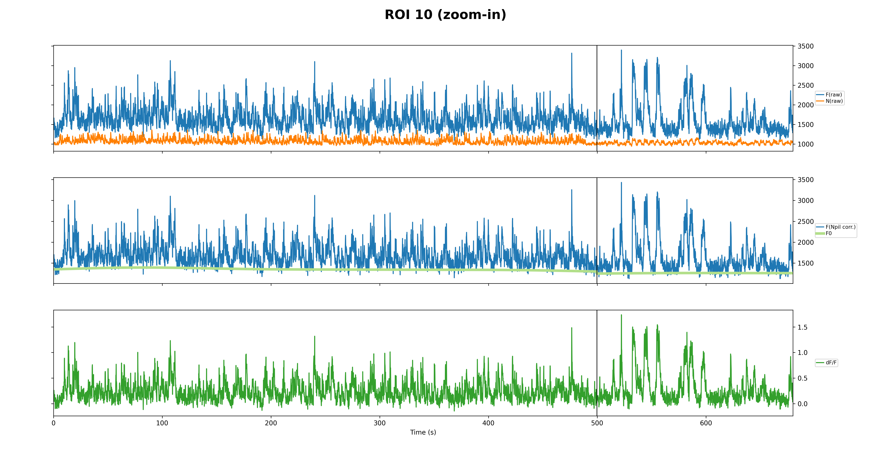

# Reading multi-plane z-registration plots

These examples accompany [Algorithm 2: multi-plane z-registration](z-registration.md). The first
three plot types are written by `zregister` to `<directories.output>/suite2p/plots/`. After ROI
curation, the optional `correct-traces` step with `use_zstack: false` writes the ROI figures to
`<directories.output>/2P_processed/plane_z/plots/` when `delta_F.plot` is enabled. The ROI step
calculates neuropil-corrected fluorescence, a baseline, and dF/F from the already z-registered
movie; it does not perform another axial correction.

The supplied registration images are from two recordings: the first provides all three standard
plots, and the second shows the two image panels with a second-channel registration example. The
individual ROI traces come from a third recording. Treat them as separate examples rather than
panels of one dataset. The ROI-overview image has no dataset identifier in its filename, so its
recording should be confirmed before associating it with the individual trace example.

## 1. Compare the per-plane references

**`01_reference_images.png`** shows one Suite2p reference image for each retained acquisition
plane. The title in red marks the plane selected as the registration reference. In the first
example the displayed planes are 2-6 and plane 4 is selected; in the second they are 3-7 and
plane 5 is selected. Compare recognizable structures across neighbouring planes and check that
the displayed plane IDs match the intended non-flyback set. Differences in brightness or detail
can also reflect genuine changes with depth.

## 2. Compare the final reference and registered mean image

**`02_mean_image_zregistration.png`** places the combined reference next to the mean image of
the z-registered output. The overlay shows the reference in red and the registered mean in green;
shared features appear yellow. Look for anatomical features in corresponding positions throughout
the field. Brightness and contrast are adjusted for display, so colour balance alone is not a
measure of registration quality. When registration uses channel 2, as in the second example, an
additional panel shows the channel 1 mean image. Compare that panel with the structural channel
in the context of the acquisition rather than treating the two channels as identical signals.

## 3. Read position and correlation over time

**`03_z_positions.png`** has two panels sharing a frame-number axis. The upper panel shows the
best-matching acquired plane for each reference image. Each colour represents a different
reference, and the tracks are vertically offset to separate them; their y-axis positions are
therefore not all literal plane numbers. The red track belongs to the selected reference. Black
vertical lines mark experiment boundaries.

The lower panel shows the highest frame-to-plane correlation for the selected reference in red.
Gray shading marks frames flagged as bad by registration. The black horizontal line is a plotted
correlation threshold; it is not itself the bad-frame mask. Read this panel alongside the position
tracks to identify intervals that deserve closer review. The underlying positions, source planes,
and correlations are saved in `plane_z/reg_outputs.npy`; see [Output schemas](outputs.md#algorithm-2-z-registration).

## 4. Review accepted ROIs on `plane_z`

**`ROIs_and_meanImg.png`** shows accepted ROI masks on the left and their outlines on the
z-registered mean image on the right. The labels are indices within the accepted ROI set used by
the trace plots, not necessarily the original Suite2p ROI IDs. Inspect the masks against the
structures of interest, especially in crowded regions and near image boundaries. ROI acceptance
and any manual curation happen in `plane_z` before the optional trace-processing step.

## 5. Review individual traces

**`ROIxxxx.png`** shows raw ROI fluorescence `F(raw)` and neuropil fluorescence `N(raw)` at the
top, neuropil-corrected fluorescence and its rolling baseline `F0` in the middle, and final dF/F
at the bottom. Vertical black lines mark recording segment boundaries. The optional
**`ROIxxxx_zoomed.png`** shows the first 5,000 frames so individual events and baseline behaviour
are easier to inspect. These traces come from `plane_z`; they have no separate z-stack profile or
z-corrected trace panel. The zoomed view is the same processing result at a shorter time scale.

For this example, compare the brief fluorescence events across the raw, neuropil-corrected, and
dF/F panels. The [trace-production guide](trace-correction.md#settings-and-quality-control-shared-by-both-modes)
describes the settings that control these plots and the baseline calculation. Scientific
interpretation of the specific events and ROI should be added after review of the acquisition and
the registered movie.
