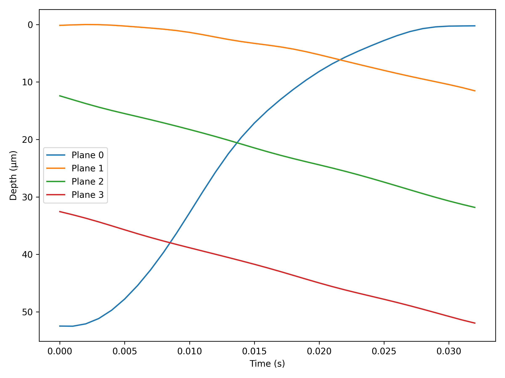
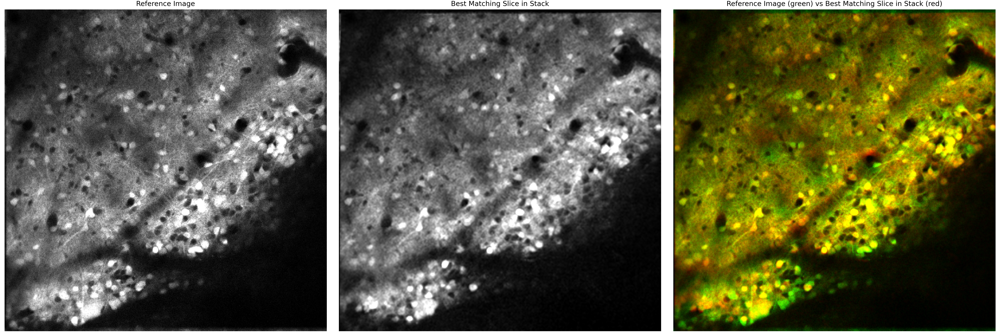
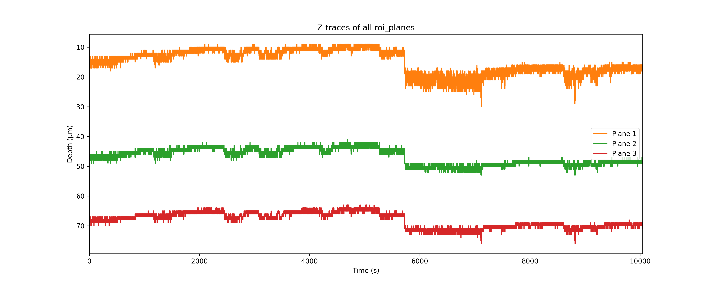
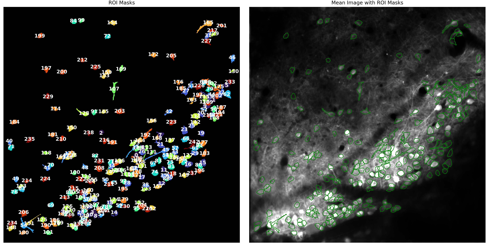
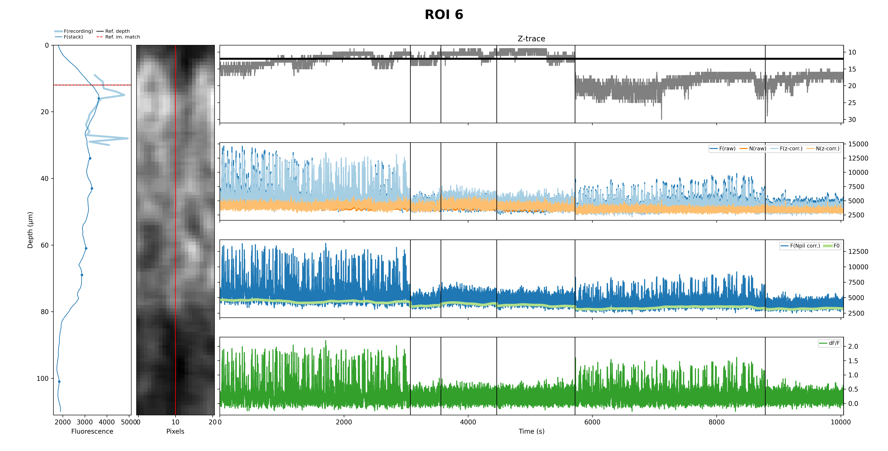
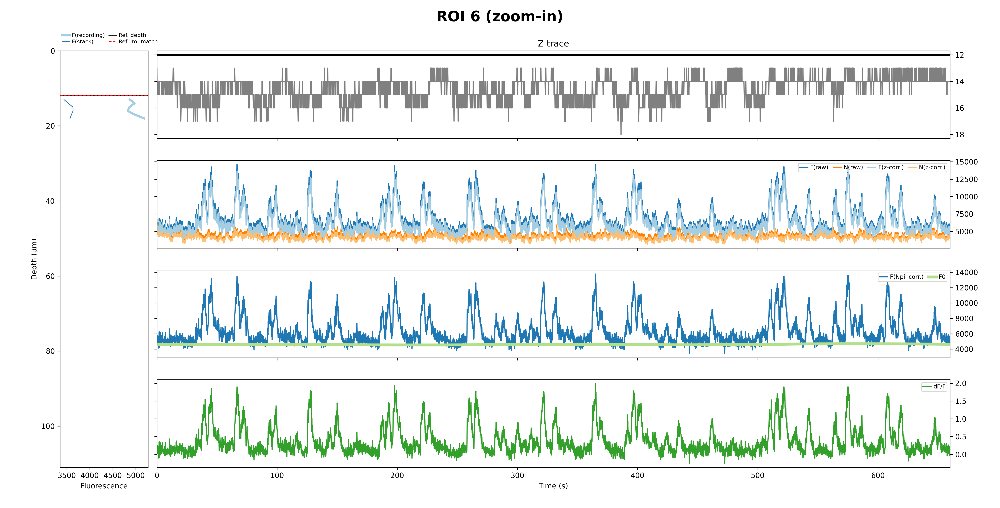
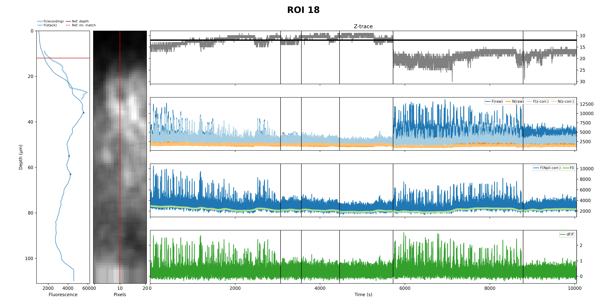
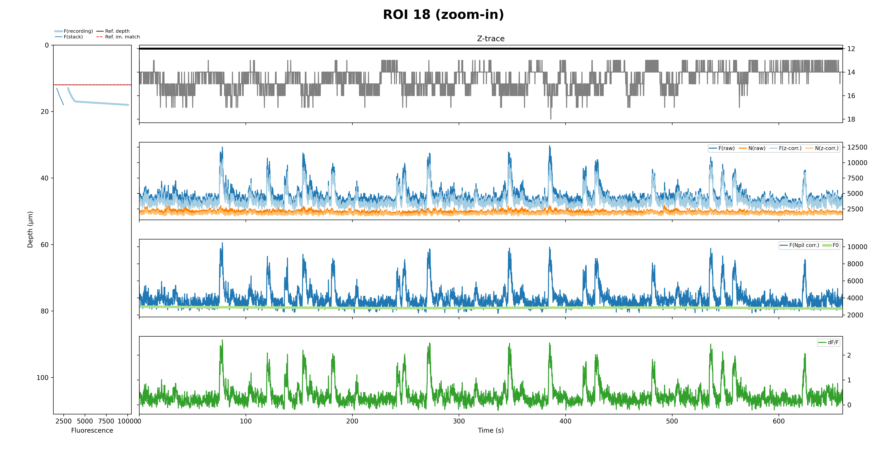
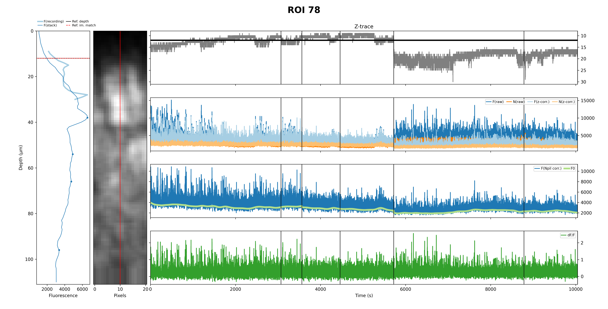
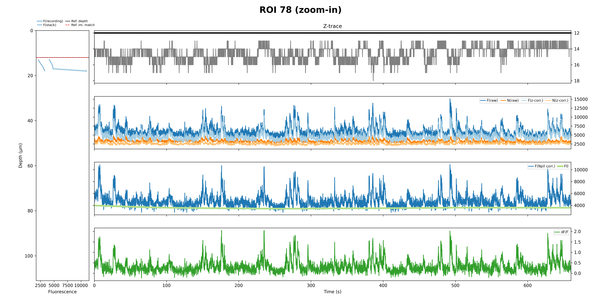

# Reading Z-stack correction plots

These examples show the quality-control figures produced around [Algorithm 1: z-stack-based trace
correction](z-stack-correction.md). They come from one recording with four acquired planes; the ROI
examples are from plane 1. Use the figures to check the acquisition geometry, stack alignment, axial
position estimates, ROI selection, and trace processing together. A plausible-looking final dF/F
trace alone does not establish that the axial correction worked.

The figures below have dataset-specific suffixes. In a normal `correct-traces` output directory,
`piezo_per_plane.png` and `zTraces_allPlanes.png` are under `2P_processed/plots/`. The other figures
are under `2P_processed/planeN/plots/`, with individual ROI figures in its `ROIs/` subdirectory.
Plot creation depends on `daq.plot_piezo`, `z_correction.plot`, and `delta_F.plot`; the optional
`_zoomed.png` plots also require `delta_F.plot_zoomed_traces` and a sufficiently long recording.

## 1. Check the scan geometry

**`piezo_per_plane.png`** shows the mean within-frame piezo trajectory for each acquired plane. The
horizontal axis is time within one frame, and the inverted vertical axis shows relative depth in
micrometres, with the top-most position set to zero. In this recording, planes 1-3 move
deeper during their frames, while plane 0 moves in the opposite direction, consistent with flyback.
We usually exclude the flyback plane because it can contain ROIs also seen in the other planes,
although z-stack correction can process it. To exclude a plane, enter its zero-based index in the
[`Ignore_planes` column](dataset-csv.md#algorithm-1-datasets_zstackcsv) of `datasets_zstack.csv`.

Compare the curve shapes, plane order, and spacing with your imaging settings. An incorrect plane
count, DAQ synchronization, or voltage-to-distance calibration can affect stack reslicing and ROI
depths. If the plot differs from your expectations, check:

- that the piezo moved as expected;
- that the DAQ recorded the measured piezo position rather than the command signal (which may look
  sawtooth-shaped);
- that `daq.piezo_channel_name` selects the piezo signal in
  [`get_piezo_data`](../src/suite2p_in_depth/extract_data.py#L166), and `daq.clock_channel_name`
  selects the frame clock in [`get_frame_times`](../src/suite2p_in_depth/extract_data.py#L210);
- that [`daq.piezo_volt_per_micron`](../src/suite2p_in_depth/config/zstack.yaml#L30) matches your piezo calibration.

To inspect piezo motion before running the full pipeline, use the
[`suite2p-in-depth plot-piezo` CLI subcommand](helper-utilities.md#plot-piezo).

## 2. Check movie-to-stack alignment

**`Reference_and_matchingSlice.png`** compares the functional movie's reference image with the
registered and resliced stack slice selected as its best match. The third panel shows the movie
reference in green and the stack slice in red. Shared landmarks appear yellow where they overlap;
separated red and green edges reveal local disagreement. In this example, the main tissue boundary
and many bright structures occupy similar positions in the two grayscale panels. Inspect small
features across the field as well as the overall outline. Different fluorescence contrast can make
an otherwise aligned feature look different, so use anatomical correspondence rather than colour
balance alone.

## 3. Check the estimated axial trajectory

**`zTraces_allPlanes.png`** puts the estimated position of each processed plane on a common time
axis. In this recording the three traces change at similar times, including a larger shared shift
around 5,700 seconds. Compare such changes with the acquisition and with changes in the ROI plots;
the figure by itself cannot establish whether a shift is motion or a matching error. Investigate
long gaps, positions repeatedly reaching the evaluated stack edges, or a single plane behaving
inconsistently with the others. Edge matches are set to NaN because the true position is unresolved
there.

**Axis caveat:** The current PNG labels its vertical axis `Depth (µm)`, but the plotted values and
`2pPlanes.zTraces.npy` are stack-slice indices. Convert a *difference* in indices to micrometres
using `z_correction.spacing`; an absolute depth also needs a defined stack origin. Do not read the
axis numbers as micrometres without confirming that conversion.

## 4. Check the accepted ROIs

**`ROIs_and_meanImg.png`** shows the accepted ROI masks on the left and their outlines over the
registered mean image on the right. Inspect whether outlines follow the structures of interest,
and whether crowded or dim regions contain merged, fragmented, or implausibly shaped ROIs. The
numbers in this figure are indices within the accepted ROI set used by the trace plots; they are
not necessarily the original Suite2p ROI indices. The three examples below are ROIs 6, 18, and 78
from this plane.

## 5. Read an individual ROI plot

Each full **`ROIxxxx.png`** has a stack fluorescence profile and a narrow stack cross-section at
left, followed by four time-series panels. The top time series is the plane's estimated z position.
Below it are raw ROI/neuropil fluorescence with their z-corrected versions, neuropil-corrected
fluorescence with its rolling baseline `F0`, and final dF/F. Vertical black lines mark recording
segment boundaries. The profile compares fluorescence sampled during the recording at estimated
depths (`F(recording)`) with the ROI's stack profile (`F(stack)`). Its black horizontal line is the
chosen reference depth; the red dashed line marks the stack slice matched to the movie reference.

The **`ROIxxxx_zoomed.png`** version shows the first 5,000 frames on a more readable time scale
and omits the stack cross-section. It is a view of the same processing result, not a separate
correction. Note that the profile and z-trace depth axes also use stack-slice indices despite the
`Depth (µm)` label; the same axis caveat applies here.

### ROI 6

The full view makes the change in estimated depth and the quieter middle recording segment easy
to compare with the fluorescence panels. The zoomed view exposes individual fluorescence events
and the corresponding dF/F peaks. Check whether the z-corrected traces preserve event timing and
whether broad intensity shifts that track z position are reduced.

### ROI 18

This ROI shows a different stack profile and changes in event density across recording segments.
Use the zoomed panel to compare the ROI and neuropil transients, then check whether the fitted
baseline follows the slower fluorescence level rather than the brief peaks. The visual comparison
does not determine which events are neural without additional evidence.

### ROI 78

ROI 78 gives another comparison between depth changes and fluorescence across the same recording.
Its zoomed view has a different mix of sharp and broader transients. Compare raw and corrected
traces at each depth transition, then check whether the dF/F baseline remains interpretable.

Across ROIs, look for correction-induced jumps, large changes tied tightly to the z trace,
near-zero or negative baselines, long NaN stretches, or neuropil transients that dominate the ROI
signal. None of these has a universal visual cutoff; review the underlying Suite2p ROI and movie,
the acquisition calibration, and the saved arrays before accepting or rejecting a result. Array
names, shapes, and NaN meanings are listed in [Output schemas](outputs.md#algorithm-1-z-stack-based-trace-correction).
